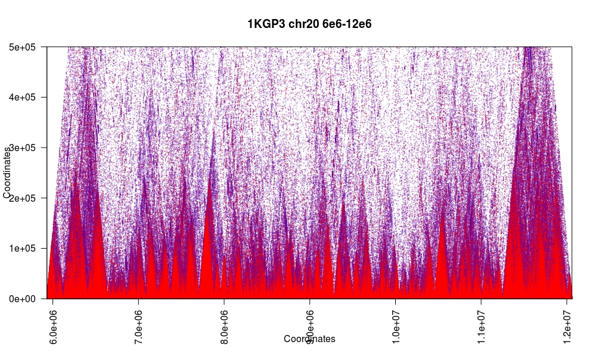

[](https://travis-ci.org/mklarqvist/tomahawk)
[](https://github.com/mklarqvist/tomahawk/releases)
[](LICENSE)


# Fast calculation of LD in large-scale cohorts
Tomahawk is a machine-optimized library for computing linkage-disequilibrium from population-sized datasets. Tomahawk permits close to real-time analysis of regions-of-interest in datasets of many millions of diploid individuals.

Tomahawk efficiently compress genotypic data by exploiting intrinsic genetic properties and we describe algorithms to directly query, manipulate, and explore this jointly compressed representation in-place. We represent genotypic vectors as fixed-width run-length encoded (RLE) objects. This encoding scheme is generally superior to dynamic-width encoding approaches in terms of iteration speed but inferior in terms of compressibility. The primitive type of RLE entries is fixed across a file and is determined contextually depending on the total number of samples. 

We describe efficient algorithms to calculate genome-wide linkage disequilibrium for all pairwise alleles/genotypes in large-scale cohorts. In order to achieve speed, Tomahawk combines two efficient algorithms that exploit different concepts: 1) low genetic diversity and 2) large memory registers on modern processors. The first algorithm directly compares RLE entries from two vectors. The other transforms RLE entries to uncompressed bit-vectors and use machine-optimized SIMD-instructions to directly compare two such bit-vectors. This second algorithm also exploits the relatively low genetic diversity within species using implicit heuristics. Both algorithms are embarrassingly parallel and have been successfully tested on datasets with up to 10 million individuals using thousands of cores on hundreds of machines using the [Wellcome Trust Sanger Institute](http://www.sanger.ac.uk/) compute farm.

The current format specifications (v.0) for `TWK`,`TWO`, and `LD` are available [TWKv0](spec/TWKv0.pdf)

## Table of contents
- [Getting started](#getting-started)
    - [Installation instructions](#installation-instructions)
    - [Brief usage instructions](#brief-usage-instructions)
- [Importing to Tomahawk](#importing-to-tomahawk)
- [Importing sequence variant data (`vcf`/`bcf`)](#importing-sequence-variant-data-vcfbcf)
- [Calculating linkage disequilibrium](#calculating-linkage-disequilibrium)
- [Converting between file formats and filtering](#converting-between-file-formats-and-filtering)
- [Subsetting output](#subsetting-output)
- [Sort a `TWO` file](#sort-a-two-file)
- [Plotting in R](#plotting-in-R)
- [Author](#author)
- [Acknowledgements](#Acknowledgements)
- [License](#license)

## Getting started
### Installation instructions
For modern x86-64 CPUs with `SSE4.2` or later, just type `make` in the `build`
directory. If you see compilation errors, you most likely do not have `SSE4.2`.
At the present time, we do not support non-x86-64 CPUs or old CPU architecture.
```bash
git clone --recursive https://github.com/mklarqvist/tomahawk
cd tomahawk
cd build
make
```
By default, Tomahawk compiles using aggressive optimization flags and
with native architecture-specific instructions
(`-march=native -mtune=native -ftree-vectorize -pipe -frename-registers -funroll-loops`)
and internally compiles for the most recent SIMD-instruction set available.
This might result in additional effort when submitting jobs to
computer farms/clouds with a hardware architecture that is different from the
compiled target. If this is too cumbersome for your application then replace `-march=native -mtune=native` with `-msse4.2`. This will result in a potentially large loss of compute speed.  
Because Tomahawk is compiled using native CPU-instructions by default, no pre-compiled binaries are available for download.

### Brief usage instructions
Tomahawk comprises five primary commands: `import`, `calc`, `view`, `sort`, and `concat`.
Executing `tomahawk` gives a list of commands with brief descriptions and `tomahawk <command>`
gives detailed details for that command.

All primary Tomahawk commands operate on the binary Tomahawk `twk` and Tomahawk output `two` file format. Interconversions between `twk` and `vcf`/`bcf` is supported through the
commands `import` for `vcf`/`bcf`->`twk` and `view` for `twk`->`vcf`. Linkage
disequilibrium data is written out in `two` format.

## Importing to Tomahawk
By design Tomahawk only operates on diploid and bi-allelic SNVs and as such filters out indels and complex variants. Tomahawk does not support mixed phasing of genotypes
in the same variant (e.g. `0|0`, `0/1`). If mixed phasing is found for a record,
all genotypes for that site are converted to unphased genotypes. This is a conscious design choice as this will internally invoke the correct algorithm to use for mixed-phase cases.  

### Importing sequence variant data (`vcf`/`bcf`)
Importing standard files to Tomahawk involes using the `import` command.
The following command imports a `vcf` file and outputs `outPrefix.twk` while filtering out variants with >20% missingness and sites that deviate
from Hardy-Weinberg equilibrium with a probability < 0.001
```bash
tomahawk import -i file.vcf -o outPrefix -m 0.2 -H 1e-3
```

## Calculating linkage disequilibrium
In this example we force computations to use phased math (`-p`) and show a live progressbar
(`-d`). Generated data is filtered for minimum genotype frequency (`-a`), squared Pearson correlation
coefficient (`-r`) and by test statistics P-value (`-p`). Total computation is partitioned into 990 psuedo-balanced blocks (`-c`)
and select the first partition (`-C`) to compute using 28 threads (`-t`);
```bash
tomahawk calc -pdi file.twk -o output_prefix -a 5 -r 0.1 -P 0.1 -c 990 -C 1 -t 28
```
This command will output the file `output_prefix.two`

## Converting between file formats and filtering
Printing the contents of a `twk` as `vcf` involves the `view` command
 ```bash
tomahawk view -i file.twk -o file.vcf
```

Viewing `ld` data from the binary `two` file format and filtering out lines with a
Fisher's exact test P-value < 1e-4, minor haplotype frequency < 5 and have
FLAG bits `4` set
```bash
tomahawk view -i file.two -P 1e-4 -a 5 -f 4
 ```

 The `two` FLAG values are bit-packed booleans in a single integer field and describe a variety of states a pair of markers can be in.

| Description                          | Bit number | Bit value |
|--------------------------------------|------------|-----------|
| Markers are phased                   | 1          | 1         |
| Has missing values                   | 2          | 2         |
| Incomplete                           | 3          | 4         |
| Multiple valid roots                 | 4          | 8         |
| Markers on the same contig           | 5          | 16        |
| Markers far apart on the same contig | 6          | 32        |
| Marker A failed HWE test             | 7          | 64        |
| Marker B failed HWE test             | 8          | 128       |
| Marker A have low MAF                | 9          | 256       |
| Marker B have low MAF                | 10         | 512       |

## Subsetting output
It is possible to filter `two` output data by: 
1) either start or end contig e.g. `chr1`, 
2) position in that contig e.g. `chr1:10e6-20e6`; 
3) have a particular contig mapping e.g. `chr1,chr2`; 
4) interval mapping in both contigs e.g. `chr1:10e3-10e6,chr2:0-10e6`

```bash
tomahawk view -i file.two -I chr1:10e3-10e6,chr2:0-10e6
 ```

## Sort a `TWO` file
Partially sort `two` file in 500 MB chunks
```bash
tomahawk sort -i file.two -o partial.two -L 500
```

Perform k-way merge of partially sorted blocks
```bash
tomahawk sort -i partial.two -o sorted.two -M
```

## Plotting in `R`
Plotting `two` data converted into `ld` format using the supplied `R` scripts (in the `R` directory).
First transform a `two` file into human-readable `ld` format:
```bash
tomahawk view -hi 1kgp3_chr2_105_1.two > 1kgp3_chr2_105_1.ld
```

Either `source` the [R/example_region.R](R/example_region.R) file or copy-paste this code into `R`:
```R
# Specify colour scheme
colors<-paste0(colorRampPalette(c("blue","red"))(10),seq(0,100,length.out = 11))
colors[1]<-paste0(colors[1],"0")
colors[length(colors)]<- substr(colors[length(colors)],1,7)

# Define support functions
plotLDRegion<-function(dataSource, from, to, ...){
  # Assumes all the data is from the same chromosome
  b<-dataSource[dataSource$POS_A >= from & dataSource$POS_A <= to & dataSource$POS_B >= from & dataSource$POS_B <= to,]
  b<-b[order(b$R2,decreasing = F),] # sort for Z-stack
  plot(b$POS_A,b$POS_B,pch=20,cex=.2,col=colors[cut(b$R2,breaks=seq(0,1,length.out = 11),include.lowest = T)],xlim=c(from,to),ylim=c(from,to),xaxs="i",yaxs="i", ...)
}

plotLDRegionTriangular<-function(dataSource, from, to, ...){
  # Assumes all the data is from the same chromosome
  b<-dataSource[dataSource$POS_A>=from & dataSource$POS_A<=to & dataSource$POS_B>=from & dataSource$POS_B<=to,]
  b<-b[b$POS_A<b$POS_B,] # upper triangular only
  b<-b[order(b$R2,decreasing = F),] # sort for Z-stack
  plot(b$POS_A + ((b$POS_B-b$POS_A)/2),b$POS_B-b$POS_A,pch=20,cex=.2,col=colors[cut(b$R2,breaks=seq(0,1,length.out = 11),include.lowest = T)],xaxs="i",yaxs="i", ...)
}
```

Load the `ld` data we generated:
```R
# Load some LD data from Tomahawk
ld<-read.delim("1kgp3_chr2_105_1.ld",h=F)
```
and then plot it using either of the two support functions. First plotting the data as is (upper-triangular)
```R
plotLDRegion(ld, 2e6, 5e6, xlab="Coordinates",ylab="Coordinates",main="1KGP3 chr20 2e6-5e6", las=2)
```


or plotting the upper-triangular rotated 45 degrees
```R
plotLDRegionTriangular(ld, 2e6, 5e6, xlab="Coordinates",ylab="Coordinates",main="1KGP3 chr20 2e6-5e6", las=2)
```
  

Plotting large regions can be achieved by truncating the Y-axis:
```R
plotLDRegionTriangular(ld, min(ld$V3), max(ld$V5), xlab="Coordinates",ylab="Coordinates",main="1KGP3 chr20 6e6-12e6", las=2,ylim=c(0,0.5e6))
```


If your data has been sorted and expanded (symmetric) for rapid queries each data point is represented twice ([A,B], and [B,A]):
```R
# Load some symmetric LD data from Tomahawk
ld<-read.delim("1kgp3_chr2_105_1_symmetric.ld",h=F)
plotLDRegion(ld, 1e6, 4e6, xlab="Coordinates",ylab="Coordinates",main="1KGP3 chr20 1e6-4e6", las=2)
```
  

This figure demonstrates how Tomahawk partitions the workload in order to maximize data locality. Shown here is part 1 and 10 out of 45 for the 1000 Genomes data for chromosome 20. This data locality can have profound impact on runtime: in many cases it is faster to run many smaller partitions of the data instead of several larger ones.   


### Author
Marcus D. R. Klarqvist (<mk819@cam.ac.uk>)  
Department of Genetics, University of Cambridge  
Wellcome Trust Sanger Institute

### Acknowledgements 
[Professor John A Todd](https://www.ndm.ox.ac.uk/principal-investigators/researcher/john-todd) Nuffield Department of Medicine, University of Oxford  
[Chris Wallace](https://github.com/chr1swallace) MRC Biostatistics Unit, University of Cambridge  
[Professor Richard Durbin](https://github.com/richarddurbin), Wellcome Trust Sanger Institute, and Department of Genetics, University of Cambridge  

### License
[MIT](LICENSE)
