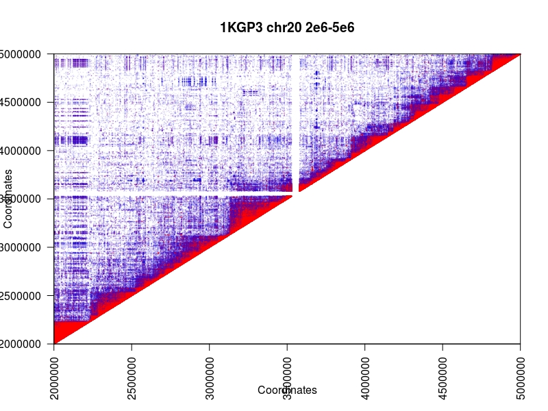
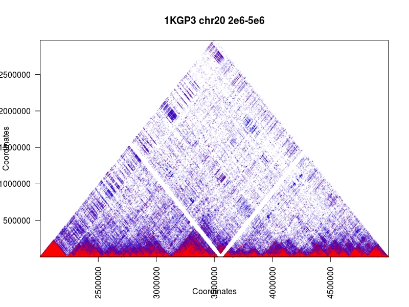
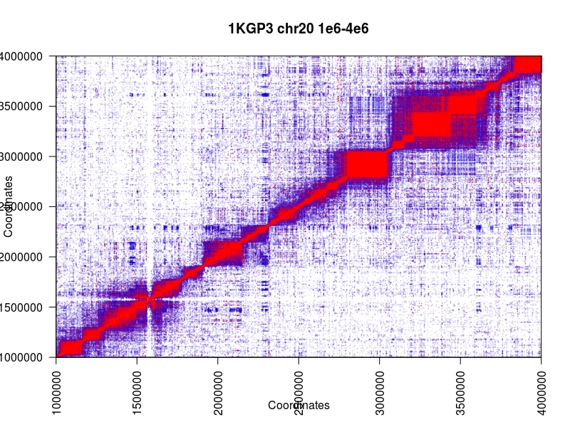
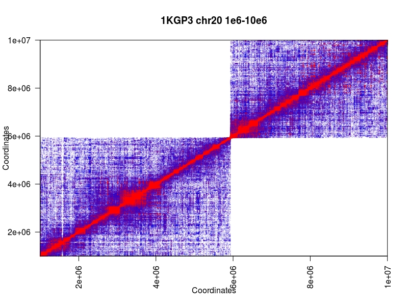

[](https://travis-ci.org/mklarqvist/tomahawk)
[](https://github.com/mklarqvist/tomahawk/releases)
[](LICENSE)


## Fast calculation of LD in large-scale cohorts
Tomahawk efficiently compress genotypic data by exploiting intrinsic genetic properties and we describe algorithms to directly query, manipulate, and explore this jointly compressed representation in-place. We represent genotypic vectors as fixed-width run-length encoded (RLE) objects with the five highest bits encoding for phasing, allele A, allele B, and the remainder as the run-length. This encoding scheme is superior to dynamic-width encoding appro  aches in terms of iteration speed but inferior in terms of compressibility. The word size (`uint8_t`, `uint16_t`, `uint32_t`, or `uint64_t`) of RLE entries is fixed across a file and is determined contextually contingent on the number of samples. Tomahawk has three primary internal functions: 

1) iterate over sites and RLE entries; 
2) partition compressed genotypic vectors into groups;
3) computing the inner product of compressed genotypic vectors;

We describe efficient algorithms to calculate genome-wide linkage disequilibrium for all pairwise alleles/genotypes in large-scale cohorts. In order to achieve speed, Tomahawk combines primarily two efficient algorithms exploiting different concepts: 1) low genetic diversity and 2) the large memory registers on modern processors. The first algorithm directly compares RLE entries from two vectors. The other transforms RLE entries to bit-vectors and use SIMD-instructions to directly compare two such bit-vectors. This second algorithm also exploits the relatively low genetic diversity within species using implicit heuristics. Both algorithms are embarrassingly parallel.

The current format specifications (v.0) for `TWK`,`TWO`, and `TGZF`
are available [TWKv0](spec/TWKv0.pdf)

### Author
Marcus D. R. Klarqvist (<mk819@cam.ac.uk>)  
Department of Genetics, University of Cambridge  
Wellcome Trust Sanger Institute


### Installation instructions
For modern x86-64 CPUs with `SSE4.2` or later, just type `make` in the `build`
directory. If you see compilation errors, you most likely do not have `SSE4.2`.
At the present time, we do not support non-x86 CPUs or old CPU architecture.
```bash
git clone --recursive https://github.com/mklarqvist/tomahawk
cd tomahawk
cd build
make
```
By default, Tomahawk compiles using extremely aggressive optimization flags and
with native architecture-specific instructions
(`-march=native -mtune=native -ftree-vectorize -pipe -frename-registers -funroll-loops`)
and internally compiles for the most recent SIMD-instruction set available.
This might result in additional effort when submitting jobs to
computer farms/clouds with a hardware architecture that is different from the
compiled target.

### Brief usage instructions
Tomahawk comprises five primary commands: `import`, `calc`, `view`, `sort`, and `concat`.
Executing `tomahawk` gives a list of commands with brief descriptions and `tomahawk <command>`
gives detailed details for that command.

All primary Tomahawk commands operate on the binary Tomahawk `twk` and Totempole `twi` file
format. Interconversions between `twk` and `vcf`/`bcf` is supported through the
commands `import` for `vcf`/`bcf`->`twk` and `view` for `twk`->`vcf`. Linkage
disequilibrium data is written out in `two` and `toi` format.

### Importing to Tomahawk
By design Tomahawk only operates on bi-allelic SNVs and as such filters out
indels and complex variants. Tomahawk does not support mixed phasing of genotypes
in the same variant (e.g. `0|0`, `0/1`). If mixed phasing is found in a line,
all genotypes in that line are converted to unphased. Importing a variant document (`vcf`/`bcf`)
to Tomahawk requires the `import` command.
The following command line imports a `vcf` file and outputs `outPrefix.twk` and
`outPrefix.twk.twi` and filters out variants with >20% missingness and deviate
from Hardy-Weinberg equilibrium with a probability < 0.001
```bash
tomahawk import -i file.vcf -o outPrefix -m 0.2 -H 1e-3
```

### Calculating all-vs-all linkage disequilibrium
In this example we force computations to use phased math (`-p`) and show a live progressbar
(`-d`). Generated data is filtered for minimum genotype frequency (`-a`), squared correlation
coefficient (`-r`) and by test statistics P-value (`-p`). Total computation is partitioned into 990 psuedo-balanced blocks (`-c`)
and select the first partition (`-C`) to compute using 28 threads (`-t`);
```bash
tomahawk calc -pdi file.twk -o output_prefix -a 5 -r 0.1 -P 0.1 -c 990 -C 1 -t 28
```

### Converting between file formats and filtering
Viewing LD data from the binary `two` file format and filtering out lines with a
Fisher's exact test P-value < 1e-4, minor haplotype frequency < 5 and have
FLAG bits `4` set
```bash
tomahawk view -i file.two -P 1e-4 -a 5 -f 4
 ```

It is possible to filter `two` output data by: 1) either start or end contig e.g.
`chr1`, 2) position in that contig `chr1:10e6-20e6`, or 3) or have a particular
contig mapping `chr1,chr2`, or 4) a particular regional mapping in both contigs
`chr1:10e3-10e6,chr2:0-10e6`
```bash
tomahawk view -i file.two chr1:10e3-10e6,chr2:0-10e6
 ```

Converting a `twk` file to `vcf`
 ```bash
tomahawk view -i file.twk -o file.vcf
```

### Sort `TWO` file
Partially sort `two` file in 500 MB chunks
```bash
tomahawk sort -i file.two -o partial.two -L 500
```

Perform k-way merge of partially sorted blocks
```bash
tomahawk sort -i partial.two -o sorted.two -M
```

## Plotting
Plotting `two` data converted into `ld` format using the supplied `R` scripts (in the `R` directory).
First transform a `two` file into human-readable `ld` format:
```bash
tomahawk view -hi 1kgp3_chr2_105_1.two > 1kgp3_chr2_105_1.ld
```

Either `source` the [R/example_region.R](R/example_region.R) file or copy-paste this code into `R`:
```R
# Specify colour scheme
colors<-paste0(colorRampPalette(c("blue","red"))(10),seq(0,100,length.out = 11))
colors[1]<-paste0(colors[1],"0")
colors[length(colors)]<- substr(colors[length(colors)],1,7)

# Define support functions
plotLDRegion<-function(dataSource, from, to, ...){
  # B is A but sorted for plotting reasons (Z-stack)
  b<-dataSource[dataSource$V3>=from & dataSource$V3 <= to & dataSource$V5 >= from & dataSource$V5 <= to,]
  b<-b[order(b$V13,decreasing = F),]
  plot(b$V3,b$V5,pch=20,cex=.2,col=colors[cut(b$V13,breaks=seq(0,1,length.out = 11),include.lowest = T)],xlim=c(from,to),ylim=c(from,to),xaxs="i",yaxs="i", ...)
}

plotLDRegionTriangular<-function(dataSource, from, to, ...){
  # B is A but sorted for plotting reasons (Z-stack)
  b<-dataSource[dataSource$V3>=from & dataSource$V5<=to & dataSource$V3>=from & dataSource$V5<=to,]
  b<-b[order(b$V13,decreasing = F),]
  plot(b$V3 + ((b$V5-b$V3)/2),b$V5-b$V3,pch=20,cex=.2,col=colors[cut(b$V13,breaks=seq(0,1,length.out = 11),include.lowest = T)],xaxs="i",yaxs="i", ...)
}
```

Load the `ld` data we generated:
```R
# Load some LD data from Tomahawk
ld<-read.delim("1kgp3_chr2_105_1.ld",h=F)
```
and then plot it using either of the two support functions. First plotting the data as is (upper-triangular)
```R
plotLDRegion(ld, 2e6, 5e6, xlab="Coordinates",ylab="Coordinates",main="1KGP3 chr20 2e6-5e6", las=2)
```


or plotting the upper-triangular rotated 45 degrees
```R
plotLDRegionTriangular(ld, 2e6, 5e6, xlab="Coordinates",ylab="Coordinates",main="1KGP3 chr20 2e6-5e6", las=2)
```
  

If your data has been sorted and expanded (symmetric) for rapid queries each data point is represented twice ([A,B], and [B,A]):
```R
# Load some symmetric LD data from Tomahawk
ld<-read.delim("1kgp3_chr2_105_1_symmetric.ld",h=F)
plotLDRegion(ld, 1e6, 4e6, xlab="Coordinates",ylab="Coordinates",main="1KGP3 chr20 1e6-4e6", las=2)
```


This figure demonstrates how Tomahawk partitions the workload in order to maximize data locality. Shown here is part 1 and 10 out of 45 for the 1000 Genomes data for chromosome 20. This data locality can have profound impact on runtime: in many cases it is faster to run many smaller partitions of the data instead of several larger ones.   


### License
[MIT](LICENSE)
