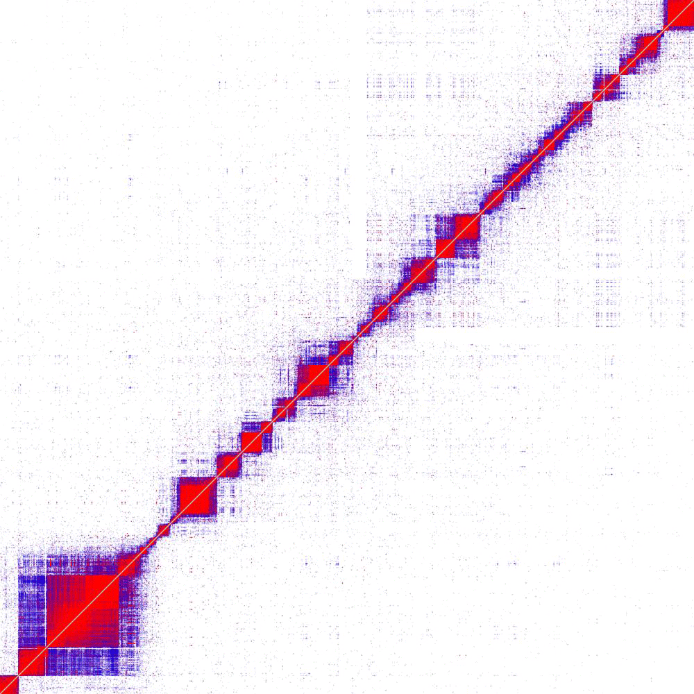
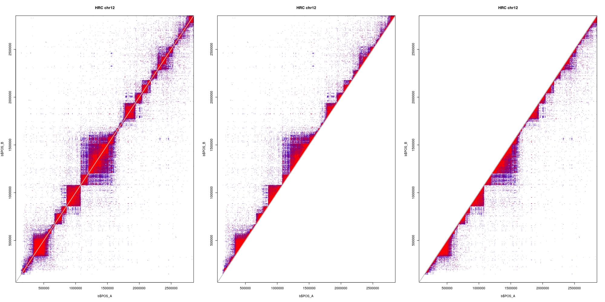
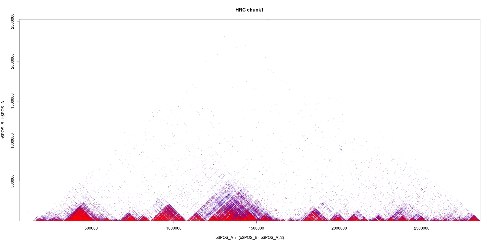
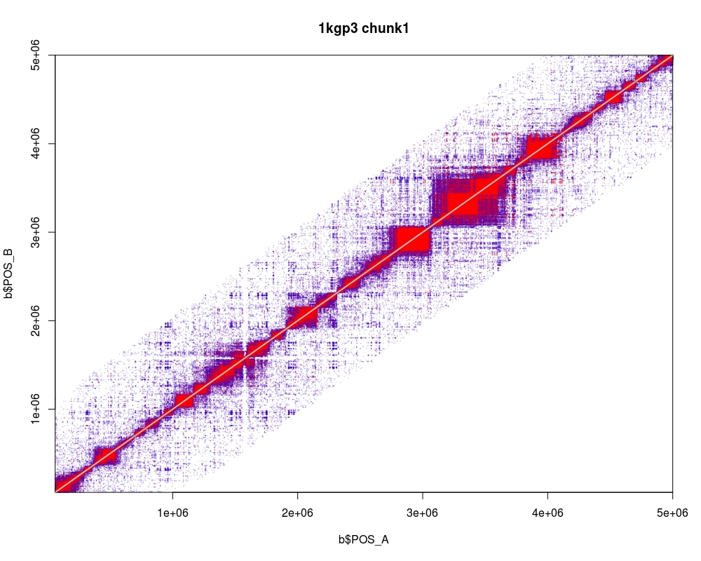
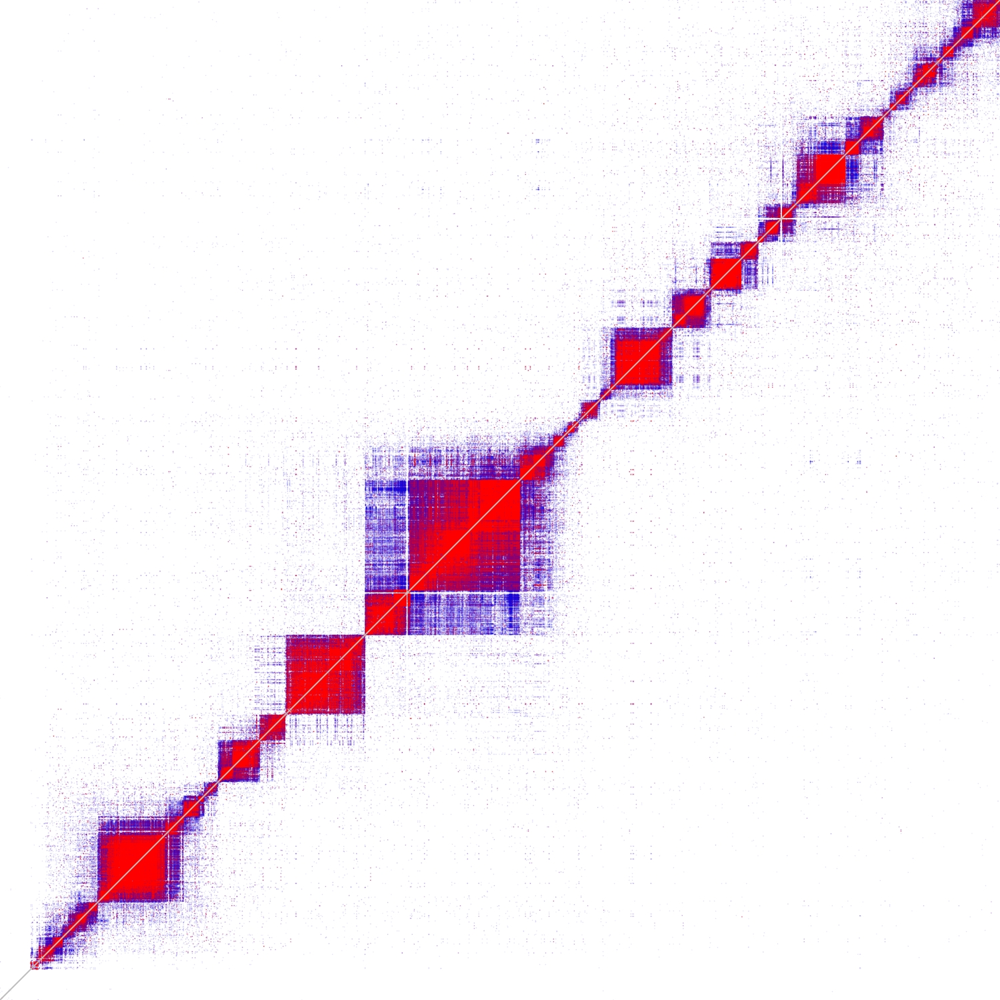
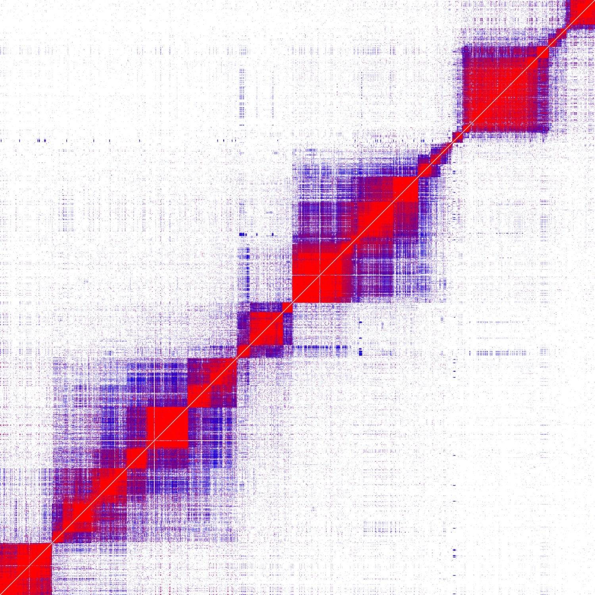

[](https://travis-ci.org/mklarqvist/tomahawk)
[](https://github.com/mklarqvist/tomahawk/releases)
[](LICENSE)


# Fast calculation of LD in large-scale cohorts
Tomahawk is a machine-optimized library for computing [linkage-disequilibrium](https://en.wikipedia.org/wiki/Linkage_disequilibrium) from population-sized datasets. Tomahawk permits close to real-time analysis of regions-of-interest in datasets of many millions of diploid individuals on a standard laptop. All algorithms are embarrassingly parallel and have been successfully tested on datasets with up to _10 million individuals_ using thousands of cores on hundreds of machines using the [Wellcome Trust Sanger Institute](http://www.sanger.ac.uk/) compute farm.

Tomahawk is unique in that it constructs complete haplotype/genotype contigency matrices for each comparison, perform statistical tests on the output data, and provide a framework for querying the resulting data. If your use-case has no need for this additional data then you can invoke fast-mode to skip the construction step for extreme performance.

The current format specifications (v.0) for `TWK`,`TWO`, `LD`, and `TGZF` are available [TWKv0](spec/TWKv0.pdf)



## Table of contents
- [Getting started](#getting-started)
    - [Installation instructions](#installation-instructions)
- [Usage instructions](#usage-instructions)
  - [Importing to Tomahawk](#importing-to-tomahawk)
  - [Importing sequence variant data (`bcf`)](#importing-sequence-variant-data-bcf)
  - [Calculating linkage disequilibrium](#calculating-linkage-disequilibrium)
  - [Sliding window](#sliding-window)
  - [Fast mode](#fast-mode)
  - [Converting between file formats and filtering](#converting-between-file-formats-and-filtering)
  - [`LD` format description](#ld-format-description)
  - [Subsetting output](#subsetting-output)
  - [Sort a `TWO` file](#sort-a-two-file)
- [Plotting in `R`](#plotting-in-r)
- [Algorithmic overview](#algorithmic-overview)
- [Author](#author)
- [Acknowledgements](#acknowledgements)
- [License](#license)

## Getting started
### Installation instructions
For modern x86-64 CPUs with `SSE4.2` or later, just type `make`.
If you see compilation errors, you most likely do not have `SSE4.2`.
At the present time, we do not support non-x86-64 CPUs or old CPU architecture.
```bash
git clone --recursive https://github.com/mklarqvist/tomahawk
cd tomahawk
make
```

### Debug mode
If you are extending upon Tomahawk or debugging, we provide a `DEBUG` flag to build with all warnings triggered and with debug symbols enabled. See the main [makefile](Makefile) for more information.
```
make DEBUG=true
```

## Usage instructions
Tomahawk comprises five primary commands: `import`, `calc`, `view`, `sort`, and `concat`.
Executing `tomahawk` gives a list of commands with brief descriptions and `tomahawk <command>`
gives detailed details for that command.

All primary Tomahawk commands operate on the binary Tomahawk `twk` and Tomahawk output `two` file format. Interconversions between `twk` and `vcf`/`bcf` is supported through the commands `import` for `bcf`->`twk` and `view` for `twk`->`vcf`. Linkage
disequilibrium data is written out in binary `two` format or human-readable `ld` format.

### Importing to Tomahawk
By design Tomahawk only operates on diploid and bi-allelic SNVs and as such filters out indels and complex variants. Tomahawk does not support mixed phasing of genotypes
in the same variant (e.g. `0|0`, `0/1`). If mixed phasing is found for a record,
all genotypes for that site are converted to unphased genotypes. This is a conscious design choice as this will internally invoke the correct algorithm to use for mixed-phase cases.  

### Importing sequence variant data (`bcf`)
Importing standard files to Tomahawk involes using the `import` command.
The following command imports a `bcf` file and outputs `outPrefix.twk` while filtering out variants with >20% missingness and sites that deviate
from Hardy-Weinberg equilibrium with a probability < 0.001
```bash
tomahawk import -i file.bcf -o outPrefix -m 0.2 -H 1e-3
```
Tomahawk does not support non-binary `vcf` files. Convert your files to `bcf` with
```bash
bcftools view file.vcf -O b -o file.bcf
```

### Calculating linkage disequilibrium
In this example we force computations to use phased math (`-p`) and show a live progressbar
(`-d`). Generated data is filtered for minimum genotype frequency (`-a`), squared Pearson correlation
coefficient (`-r`) and by test statistics P-value (`-p`). Total computation is partitioned into 990 psuedo-balanced blocks (`-c`)
and select the first partition (`-C`) to compute using 28 threads (`-t`). When computing genome-wide LD the balancing requires that number of sub-problems (`-c`) is in the set `c choose 2 + c` which is equivalent to the upper-triangular of a square (`c`-by-`c`) matrix plus the diagonal.
```bash
tomahawk calc -pdi file.twk -o output_prefix -a 5 -r 0.1 -P 0.1 -c 990 -C 1 -t 28
```
This command will output the file `output_prefix.two`

### Sliding window
If you are working with a species with well-know LD structure (such as humans) you can reduce the computational cost by limiting the search-space to a fixed-sized sliding window (`-w`). In window mode you are free to choose any arbitrary sub-problem (`-c`) size.
```bash
tomahawk calc -pdi file.twk -o output_prefix -a 5 -r 0.1 -P 0.1 -w 1e6 -t 28 -c 100 -C 1
```

### Fast mode
If you have no need of the additional information that Tomahawk produce (contigency matrices and statistics) then you can invoke fast-mode (`-f`). This mode calculates correlation and linkage coefficients extremely fast.
```bash
tomahawk calc -pdfi file.twk -o output_prefix -a 5 -r 0.1 -P 0.1 -t 28 -c 990 -C 1
```
Fast mode is available for sliding window computations
```bash
tomahawk calc -pdfi file.twk -o output_prefix -a 5 -r 0.1 -P 0.1 -t 28 -c 100 -C 1 -w 500000
```

### Converting between file formats and filtering
Printing the contents of a `twk` as `vcf` involves the `view` command
 ```bash
tomahawk view -i file.twk -o file.vcf
```

### `LD` format description
Tomahawk can output binary `two` data in the human-readable `ld` format by invoking the `view` command. The primary output columns are described below:

| Column    | Description |
|----------|-------------|
| `FLAG`     | Bit-packed boolean flags (see below) |
| `CHROM_A`  | Chromosome for marker A            |
| `POS_A`    | Position for marker A            |
| `CHROM_B`  | Chromosome for marker B            |
| `POS_B`    | Position for marker B            |
| `REF_REF`  | Inner product of (0,0) haplotypes            |
| `REF_ALT`  | Inner product of (0,1) haplotypes            |
| `ALT_REF`  | Inner product of (1,0) haplotypes            |
| `ALT_ALT`  | Inner proruct of (1,1) haplotypes            |
| [`D`](https://en.wikipedia.org/wiki/Linkage_disequilibrium)        | Coefficient of linkage disequilibrium            |
| `DPrime`   | Normalized coefficient of linkage disequilibrium (scaled to [-1,1])            |
| [`R`](https://en.wikipedia.org/wiki/Pearson_correlation_coefficient)        | Pearson correlation coefficient            |
| `R2`       | Squared pearson correlation coefficient            |
| [`P`](https://en.wikipedia.org/wiki/Fisher's_exact_test)        | Fisher's exact test P-value of the 2x2 haplotype contigency table            |
| `ChiSqModel` | Chi-squared critical value of the 3x3 unphased table of the selected cubic root (&alpha;, &beta;, or &delta;)            |
| `ChiSqTable` | Chi-squared critical value of table (useful comparator when `P` = 0)            |

The 2x2 contingency table, or matrix, for the Fisher's exact test (`P`) for haplotypes look like this:

|                | REF-A | REF-B |
|----------------|---------------|-------------------|
| **REF-B** | A             | B                 |
| **ALT-B** | C             | D                 |

The 3x3 contigency table, or matrix, for the Chi-squared test for the unphased model looks like this:

|     | 0/0 | 0/1 | 1/1 |
|-----|-----|-----|-----|
| **0/0** | A   | B   | C   |
| **0/1** | D   | E   | F   |
| **1/1** | G   | H   | J   |

The `two` `FLAG` values are bit-packed booleans in a single integer field and describe a variety of states a pair of markers can be in.

| Description                          | Bit number | Decimal value |
|--------------------------------------|------------|-----------|
| Markers are phased (or no phase uncertainty)                   | 1          | 1         |
| Markers on the same contig           | 2          | 2        |
| Markers far apart on the same contig (> 500kb) | 3          | 4        |
| Complete LD (at least one haplotype count with < 1 count OR `Dprime` > 0.99)                           | 4          | 8         |
| Perfect LD (`R2` > 0.99)                           | 5          | 16         |
| Multiple valid roots                 | 6          | 32         |
| Computed in fast mode                 | 7          | 64         |
| Was sampled in fast mode                 | 8          | 128         |
| Marker A has missing values                   | 9          | 256         |
| Marker B has missing values                   | 10          | 512         |
| Marker A have allele frequency < 0.01             | 11          | 1024       |
| Marker B have allele frequency < 0.01             | 12         | 2048       |
| Marker A failed Hardy-Weinberg equilibrium test (P < 1e-6)  | 13          | 4096        |
| Marker B failed Hardy-Weinberg equilibrium test (P < 1e-6)  | 14          | 8192       |

Viewing `ld` data from the binary `two` file format and filtering out lines with a
Fisher's exact test P-value < 1e-4, minor haplotype frequency < 5 and have
both markers on the same contig (bit `2`)
```bash
tomahawk view -i file.two -P 1e-4 -a 5 -f 2
 ```

 Example output

| FLAG | CHROM_A | POS_A | CHROM_B | POS_B | REF_REF   | REF_ALT   | ALT_REF   | ALT_ALT   | D            | Dprime     | R          | R2         | P            | ChiSqModel | ChiSqTable |
|------|---------|-------|---------|-------|-----------|-----------|-----------|-----------|--------------|------------|------------|------------|--------------|------------|------------|
| 34   | 20      | 70920 | 20      | 86115 | 4964.9971 | 8.0031128 | 2.0031128 | 32.996796 | 0.0065315999 | 0.94229311 | 0.87009358 | 0.75706285 | 4.456907e-75 | 0.18453763 | 3791.3896  |
| 34   | 20      | 86115 | 20      | 70920 | 4964.9971 | 8.0031128 | 2.0031128 | 32.996796 | 0.0065315999 | 0.94229311 | 0.87009358 | 0.75706285 | 4.456907e-75 | 0.18453763 | 3791.3896  |
| 2    | 20      | 70980 | 20      | 72892 | 4777.9951 | 3.0047445 | 8.0047445 | 218.99516 | 0.041719742  | 0.98582208 | 0.97439516 | 0.94944596 | 0            | 165.13468  | 4754.8289  |
| 2    | 20      | 72892 | 20      | 70980 | 4777.9951 | 3.0047445 | 8.0047445 | 218.99516 | 0.041719742  | 0.98582208 | 0.97439516 | 0.94944596 | 0            | 165.13468  | 4754.8289  |
| 2    | 20      | 70980 | 20      | 80481 | 4770.9849 | 10.015317 | 8.015317  | 218.98473 | 0.0416543    | 0.96299851 | 0.95858347 | 0.91888225 | 0            | 164.61061  | 4601.7605  |

Example unphased output. Notice that estimated haplotype counts are now floating values and the bit-flag 1 is not set.

| FLAG | CHROM_A | POS_A | CHROM_B | POS_B | REF_REF   | REF_ALT   | ALT_REF   | ALT_ALT   | D            | Dprime     | R          | R2         | P            | ChiSqModel | ChiSqTable |
|------|---------|-------|---------|-------|-----------|-----------|-----------|-----------|--------------|------------|------------|------------|--------------|------------|------------|
| 34   | 20      | 70920 | 20      | 86115 | 4964.9971 | 8.0031128 | 2.0031128 | 32.996796 | 0.0065315999 | 0.94229311 | 0.87009358 | 0.75706285 | 4.456907e-75 | 0.18453763 | 3791.3896  |
| 34   | 20      | 86115 | 20      | 70920 | 4964.9971 | 8.0031128 | 2.0031128 | 32.996796 | 0.0065315999 | 0.94229311 | 0.87009358 | 0.75706285 | 4.456907e-75 | 0.18453763 | 3791.3896  |
| 2    | 20      | 70980 | 20      | 72892 | 4777.9951 | 3.0047445 | 8.0047445 | 218.99516 | 0.041719742  | 0.98582208 | 0.97439516 | 0.94944596 | 0            | 165.13468  | 4754.8289  |
| 2    | 20      | 72892 | 20      | 70980 | 4777.9951 | 3.0047445 | 8.0047445 | 218.99516 | 0.041719742  | 0.98582208 | 0.97439516 | 0.94944596 | 0            | 165.13468  | 4754.8289  |
| 2    | 20      | 70980 | 20      | 80481 | 4770.9849 | 10.015317 | 8.015317  | 218.98473 | 0.0416543    | 0.96299851 | 0.95858347 | 0.91888225 | 0            | 164.61061  | 4601.7605  |

Example output for forced phased math in fast mode. Note that only the `REF_REF` count is available, the fast math bit-flag is set, and all P and Chi-squared CV values are 0.

| FLAG | CHROM_A | POS_A    | CHROM_B | POS_B    | REF_REF | REF_ALT | ALT_REF | ALT_ALT | D             | Dprime     | R          | R2         | P | ChiSqModel | ChiSqTable |
|------|---------|----------|---------|----------|---------|---------|---------|---------|---------------|------------|------------|------------|---|------------|------------|
| 67   | 20      | 54864579 | 20      | 54924952 | 4983    | 0       | 0       | 0       | 0.00099087122 | 0.55368656 | 0.36203763 | 0.13107124 | 0 | 0          | 0          |
| 67   | 20      | 54924952 | 20      | 54864579 | 4983    | 0       | 0       | 0       | 0.00099087122 | 0.55368656 | 0.36203763 | 0.13107124 | 0 | 0          | 0          |
| 75   | 20      | 54864579 | 20      | 54928203 | 4999    | 0       | 0       | 0       | 0.00019930661 | 0.99992448 | 0.33304179 | 0.11091683 | 0 | 0          | 0          |
| 75   | 20      | 54928203 | 20      | 54864579 | 4999    | 0       | 0       | 0       | 0.00019930661 | 0.99992448 | 0.33304179 | 0.11091683 | 0 | 0          | 0          |
| 67   | 20      | 54864630 | 20      | 54922169 | 4808    | 0       | 0       | 0       | 0.011086392   | 0.90247011 | 0.51148838 | 0.26162034 | 0 | 0          | 0          |

### Subsetting output
It is possible to filter `two` output data by: 
1) either start or end contig e.g. `chr1`, 
2) position in that contig e.g. `chr1:10e6-20e6`; 
3) have a particular contig mapping e.g. `chr1,chr2`; 
4) interval mapping in both contigs e.g. `chr1:10e3-10e6,chr2:0-10e6`

```bash
tomahawk view -i file.two -I chr1:10e3-10e6,chr2:0-10e6
 ```

### Sort a `TWO` file
Partially sort `two` file in 500 MB chunks
```bash
tomahawk sort -i file.two -o partial.two -L 500
```

Perform k-way merge of partially sorted blocks
```bash
tomahawk sort -i partial.two -o sorted.two -M
```

## Plotting in `R`
Plotting `two` data converted into `ld` format using the supplied `R` scripts (in the `R` directory).
First transform a `two` file into human-readable `ld` format:
```bash
tomahawk view -hi 1kgp3_chr2_105_1.two > 1kgp3_chr2_105_1.ld
```

Either `source` the [R/example_region.R](R/example_region.R) file or copy-paste this code into `R`:
```R
# Specify a blue->red colour gradient for the range [0,1] in 10 steps
colors<-paste0(colorRampPalette(c("blue","red"))(10),seq(0,100,length.out = 11))
colors[1]<-paste0(colors[1],"0") # Add opacity
colors[length(colors)]<- substr(colors[length(colors)],1,7) # Add opacity

# Define support functions
plotLDRegion<-function(dataSource, from, to, upper = FALSE, lower = FALSE, add = FALSE, ...){
  # Assumes all the data is from the same chromosome
  if(upper == TRUE){
    b<-dataSource[dataSource$POS_A >= from & dataSource$POS_A <= to & dataSource$POS_B >= from & dataSource$POS_B <= to & dataSource$POS_A < dataSource$POS_B,]
  } else if(lower == TRUE){
    b<-dataSource[dataSource$POS_A >= from & dataSource$POS_A <= to & dataSource$POS_B >= from & dataSource$POS_B <= to & dataSource$POS_B < dataSource$POS_A,]
  } else {
    b<-dataSource[dataSource$POS_A >= from & dataSource$POS_A <= to & dataSource$POS_B >= from & dataSource$POS_B <= to,]
  }
  b$R2[b$R2>1]<-1 # In cases of rounding error
  b<-b[order(b$R2,decreasing = F),] # sort for Z-stack
  if(add == TRUE){
    points(b$POS_A,b$POS_B,pch=20,cex=.2,col=colors[cut(b$R2,breaks=seq(0,1,length.out = 11),include.lowest = T)], ...)
  } else {
    plot(b$POS_A,b$POS_B,pch=20,cex=.2,col=colors[cut(b$R2,breaks=seq(0,1,length.out = 11),include.lowest = T)],xlim=c(from,to),ylim=c(from,to),xaxs="i",yaxs="i", ...)
    abline(0,1,lwd=2,col="grey")
  }
}

plotLDRegionTriangular<-function(dataSource, from, to, ...){
  # Assumes all the data is from the same chromosome
  b<-dataSource[dataSource$POS_A>=from & dataSource$POS_A<=to & dataSource$POS_B>=from & dataSource$POS_B<=to,]
  b<-b[b$POS_A<b$POS_B,] # upper triangular only
  b<-b[order(b$R2,decreasing = F),] # sort for Z-stack
  plot(b$POS_A + ((b$POS_B-b$POS_A)/2),b$POS_B-b$POS_A,pch=20,cex=.2,col=colors[cut(b$R2,breaks=seq(0,1,length.out = 11),include.lowest = T)],xaxs="i",yaxs="i", ...)
}
```

Load some `ld` data:
```R
# Load some LD data from Tomahawk
ld<-read.delim("hrc_chunk1.ld",h=T,comment.char='#')

# Use `data.table` package for fast loads
library(data.table)
ld<-fread("hrc_chunk1.ld",skip="FLAG") # First line starts with the pattern "^FLAG"
```
and then plot using either of the two support functions. First plotting the data as is (all data), upper-triangular (A < B), and lower triangular (B < A)
```R
par(mfrow=c(1,3))
plotLDRegion(ld[ld$R2>0.2,],min(ld$POS_A),max(ld$POS_B),main="HRC chr12")
plotLDRegion(ld[ld$R2>0.2,],min(ld$POS_A),max(ld$POS_B),main="HRC chr12",upper = TRUE, add = FALSE)
plotLDRegion(ld[ld$R2>0.2,],min(ld$POS_A),max(ld$POS_B),main="HRC chr12",lower = TRUE, add = FALSE)
```


or plotting the upper-triangular rotated 45 degrees
```R
plotLDRegionTriangular(ld[ld$R2>0.2,],min(ld$POS_A),max(ld$POS_B),main="HRC chunk1")
```
  

Zoom in to the triangular structure by truncating the Y-axis:
```R
plotLDRegionTriangular(ld[ld$R2>0.2,],min(ld$POS_A),max(ld$POS_B),main="HRC chunk1",ylim=c(0,500e3))
```


Plotting data computed using a sliding window will look like a diagonal stripe (1 Mb in this figure):


This figure demonstrates how Tomahawk partitions the workload in order to maximize data locality. Shown here is part 1 and 10 out of 45 for the [1000 Genomes](http://www.internationalgenome.org/data/) data for chromosome 20. This data locality can have profound impact on runtime: in many cases it is faster to run many smaller partitions of the data instead of several larger ones.   


It is possible to completely remove all labels, axis, and titles:
```R
par(mar=c(0,0,0,0)) # set all margins to 0
plotLDRegion(ld,min(ld$POS_A),max(ld$POS_B), xaxs="i", yaxs="i", xaxt='n', yaxt='n',ann=FALSE, bty="n")
```



## Algorithmic overview
Vectors of genotypes are represented as fixed-width run-length encoded (RLE) objects. This encoding scheme is generally superior to dynamic-width encoding approaches in terms of iteration speed (as no data processing is required) but inferior in terms of compressibility (as bits are wasted). The word-width of the RLE entries is fixed across a file and is determined contextually given the total number of samples. 

We describe three efficient algorithms to calculate genome-wide linkage disequilibrium for all pairwise alleles/genotypes in large-scale cohorts. The algorithms exploit different concepts: 1) low genetic diversity and 2) large memory registers on modern processors. 
1) The first algorithm directly compares fixed-width compressed RLE entries from two vectors in worst-case O(|RLE_A| + |RLE_B| + 1)-time.
2) The second transforms compressed RLE entries to uncompressed k-bit-vectors and use machine-optimized SIMD-instructions to horizontally compare two such bit-vectors in worst-case O(N/W)-time. This algorithm also exploits the relatively low genetic diversity within species using implicit heuristics. 
3) The third algorithm computes summary statistics only by maintaining a positional index of non-reference alleles and associated uncompressed 1-bit-vectors for each genotypic vector in guaranteed O(min(|NON_REF_A|,|NON_REF_B))-time. The 1-bit vectors in this algorithm is different compared to the ones used in algorithm 2.

### Author
Marcus D. R. Klarqvist (<mk819@cam.ac.uk>)  
Department of Genetics, University of Cambridge  
Wellcome Trust Sanger Institute

### Acknowledgements 
[John A Todd](https://www.ndm.ox.ac.uk/principal-investigators/researcher/john-todd), Nuffield Department of Medicine, University of Oxford  
[Chris Wallace](https://github.com/chr1swallace), MRC Biostatistics Unit, University of Cambridge  
[Richard Durbin](https://github.com/richarddurbin), Wellcome Trust Sanger Institute, and Department of Genetics, University of Cambridge  

### License
[MIT](LICENSE)
