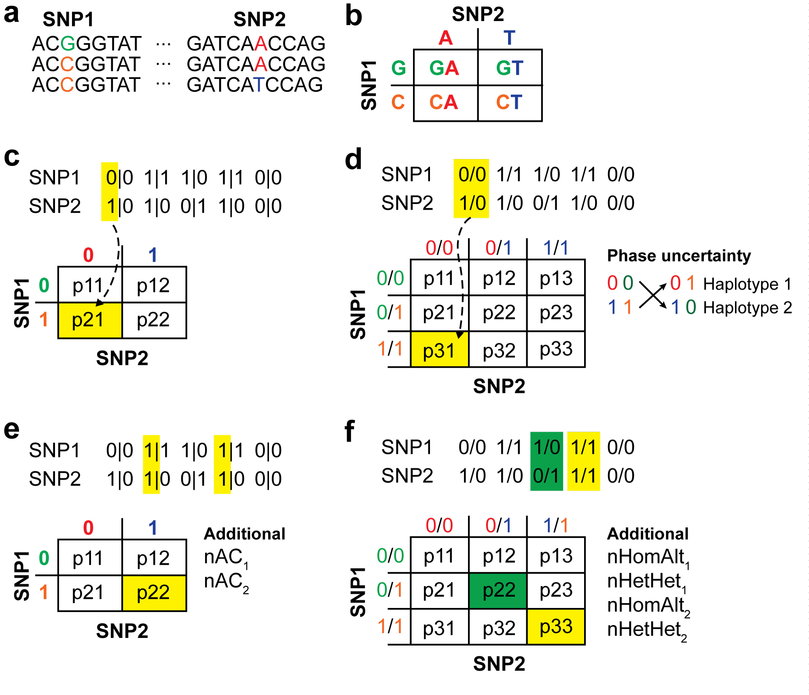
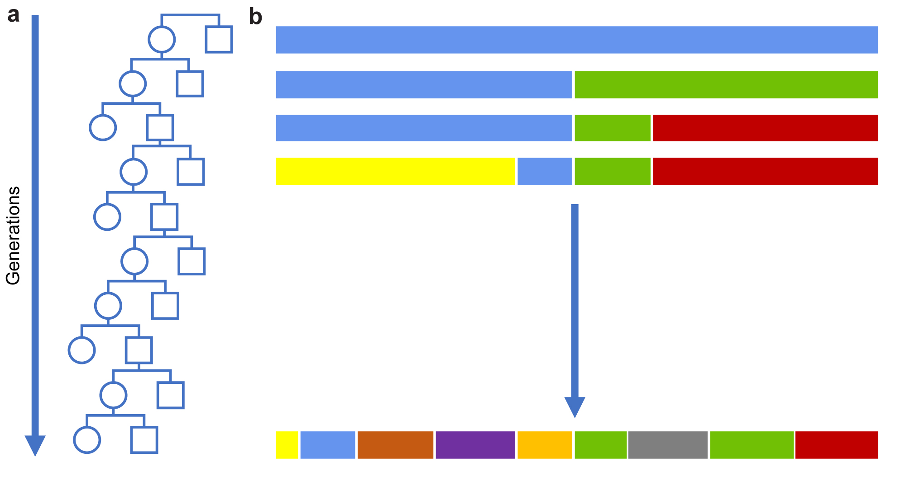

[](https://travis-ci.org/mklarqvist/tomahawk)
[](https://github.com/mklarqvist/tomahawk/releases)
[](LICENSE)

<div align="center">

</div>

# Fast calculation of LD in large-scale cohorts
Tomahawk is a machine-optimized library for computing
[linkage-disequilibrium](https://en.wikipedia.org/wiki/Linkage_disequilibrium)
from population-sized datasets. Tomahawk permits close to real-time analysis of
regions-of-interest in datasets of many millions of diploid individuals on a
standard laptop. All algorithms are embarrassingly parallel and have been
successfully tested on chromosome-sized datasets with up to _10 million_
individuals.

Tomahawk uniquely constructs complete haplotype/genotype contigency matrices for
each comparison, perform statistical tests on the output data, and provide a
framework for querying the resulting data.

## CLI Commands

| Command        | Description                                                 |
|----------------|-------------------------------------------------------------|
| [`aggregate`](cli/cli-aggregate)    | data rasterization framework for `TWO` files                |
| `calc`         | calculate linkage disequilibrium                            |
| `concat`       | concatenate `TWO` files from the same set of samples        |
| `import`       | import `VCF`/`VCF.gz`/`BCF` to `TWK`                        |
| `sort`         | sort `TWO` file                                             |
| `view`         | `TWO`-&gt;`LD`/`TWO` view, `TWO` subset and filter          |
| `haplotype`    | extract per-sample haplotype strings in `FASTA`/binary format |
| `relationship` | compute marker-based pair-wise sample relationship matrices |
| `decay`        | compute LD-decay over distance                              |
| `prune`        | perform graph-based LD-pruning of variant sites             |


``` python hl_lines="3 4"
""" Bubble sort """
def bubble_sort(items):
    for i in range(len(items)):
        for j in range(len(items) - 1 - i):
            if items[j] > items[j + 1]:
                items[j], items[j + 1] = items[j + 1], items[j]
```


<div align="center">

</div>

<div align="center">

</div>