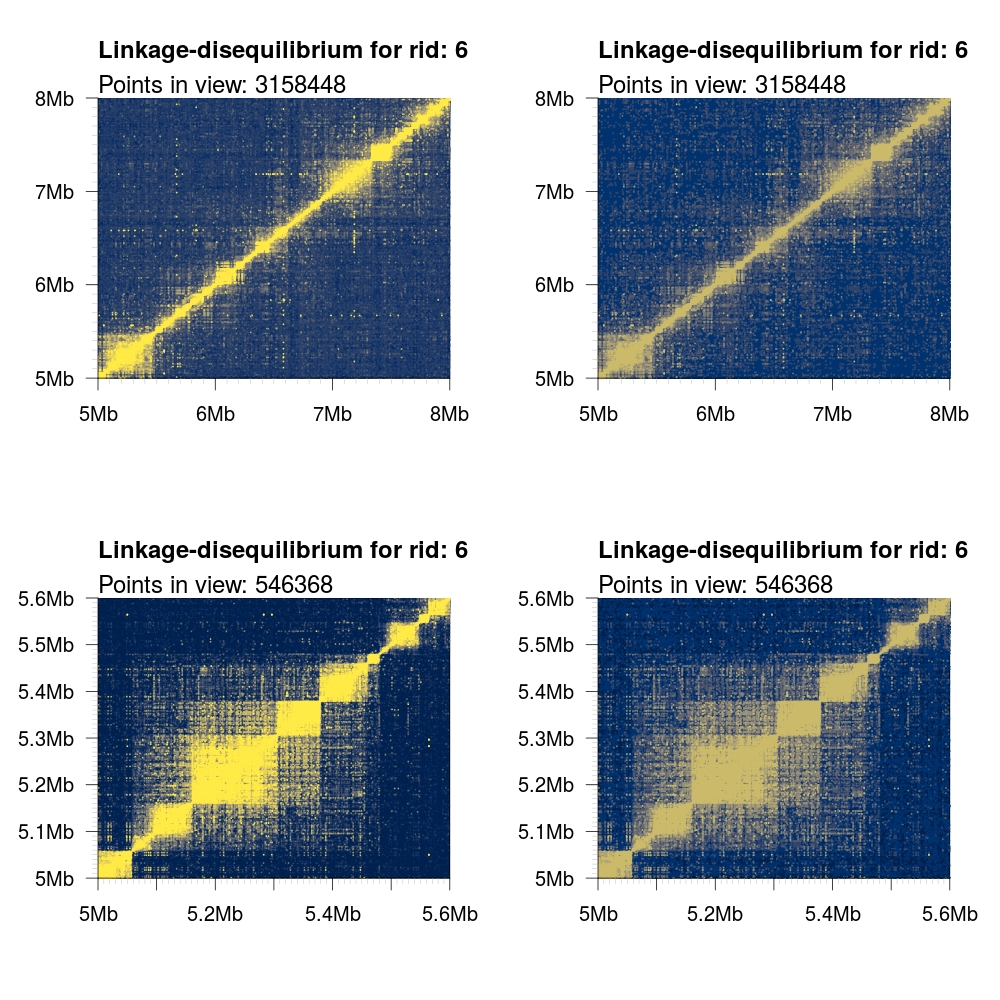
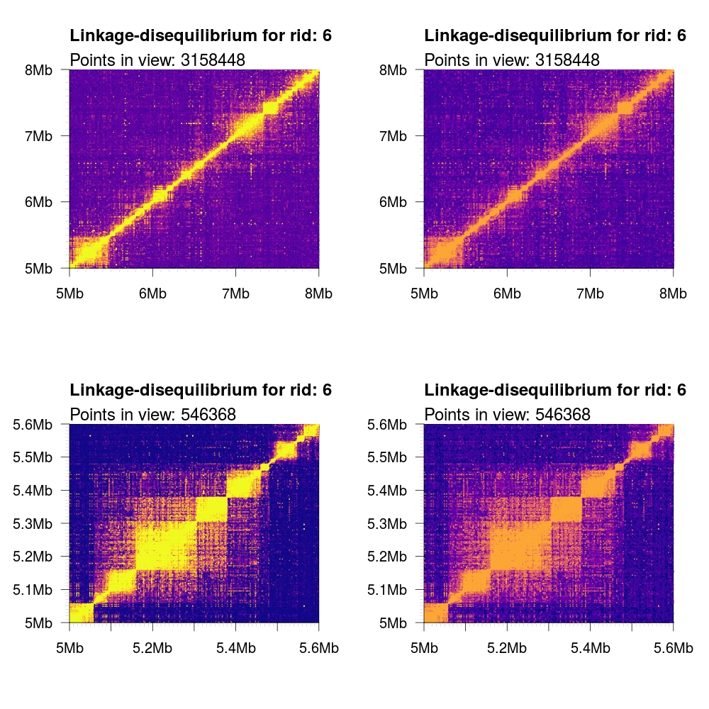
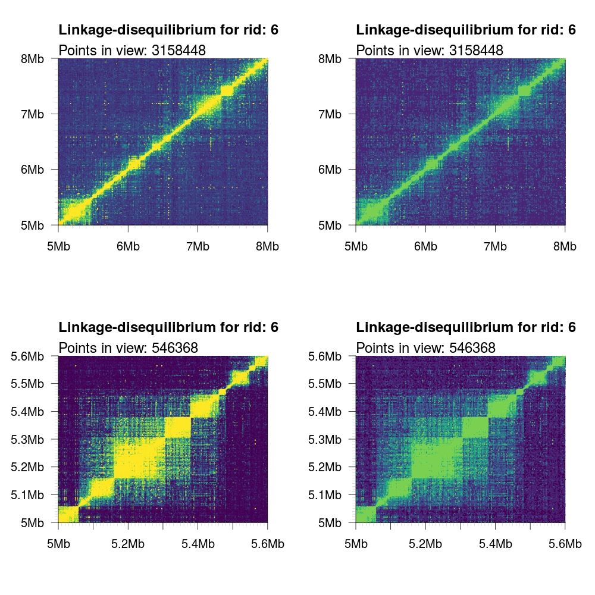
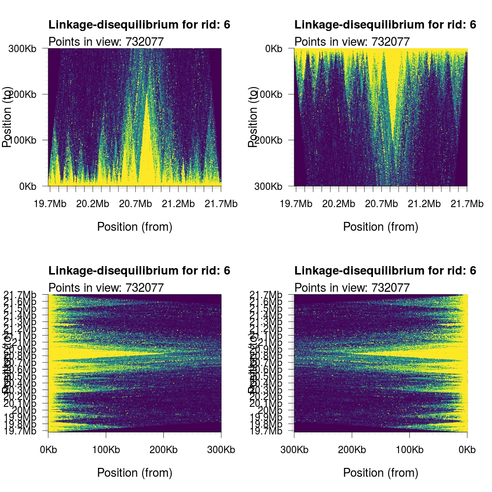
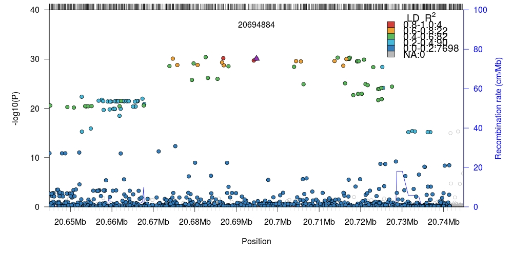

[](https://travis-ci.org/mklarqvist/tomahawk)
[](https://github.com/mklarqvist/rtomahawk/releases)
[](LICENSE)

# Getting started with `rtomahawk`

## Import files into Tomahawk
Depending on the downstream application you want to import either Tomahawk
representations of sequence variant files (`.twk`) or Tomahawk-generated output
LD data (`.two`). Both operations require minimal work. First importing a
`vcf`/`vcf.gz`/`bcf` file into the binary Tomahawk file format (`.twk`):
```R
twk <- import("1kgp3_chr20.bcf","1kgp3_chr20")
```
!!! Note "Auto-completion of file extensions"
    
    You do not have to append the `.twk` suffix to the output name as Tomahawk
    will automatically add this if missing. In the example above `"1kgp3_chr20"`
    will be converted to `"1kgp3_chr20.two"` automatically. This is true for 
    most Tomahawk commands when using the CLI but *not* when using `rtomahawk`.

!!! Warning "Unsafe method"
    
    In the current release of `rtomahawk`, this subroutine does *not* check for
    user-interruption (for example `Ctrl+C` or `Ctrl+Z`) commands. This means that
    you need to wait until the underlying process has finished or you have to
    terminate the host `R` session, in turn killing the spawned process. This will
    be fixed in upcoming releases.

By default, `rtomahawk` will print verbose output to the console during the importing
procedure:
```
[2019-01-18 14:02:25,080][LOG][READER] Opening 1kgp3_chr20.bcf...
[2019-01-18 14:02:25,088][LOG][VCF] Constructing lookup table for 86 contigs...
[2019-01-18 14:02:25,088][LOG][VCF] Samples: 2,504...
[2019-01-18 14:02:25,088][LOG][WRITER] Opening 1kgp3_chr20.twk...
[2019-01-18 14:03:15,973][LOG] Duplicate site dropped: 20:51526991
[2019-01-18 14:03:30,025][LOG] Wrote: 1,733,484 variants to 3,467 blocks...
[2019-01-18 14:03:30,025][LOG] Finished: 01m04,944s
[2019-01-18 14:03:30,025][LOG] Filtered out 79,357 sites (4.37749%):
[2019-01-18 14:03:30,025][LOG]    Invariant: 5,830 (0.321595%)
[2019-01-18 14:03:30,025][LOG]    Missing threshold: 0 (0%)
[2019-01-18 14:03:30,025][LOG]    Insufficient samples: 0 (0%)
[2019-01-18 14:03:30,025][LOG]    Mixed ploidy: 0 (0%)
[2019-01-18 14:03:30,025][LOG]    No genotypes: 0 (0%)
[2019-01-18 14:03:30,025][LOG]    No FORMAT: 0 (0%)
[2019-01-18 14:03:30,025][LOG]    Not biallelic: 8,968 (0.494693%)
[2019-01-18 14:03:30,025][LOG]    Not SNP: 63,568 (3.50654%)
```

The `import` procedure will return a new empty `twk` class with a file pointer
set to the newly created output file:
```R
> twk
An object of class twk
```

!!! success "Importing variant call archives"
    
    Success: This object is now ready to be used by other downstream functions in `rtomahawk`.

## Loading and reading `.two` data

Many functions in `rtomahawk` computes or use linkage-disequilibrium and require
a different loading procedure involving the `openTomahawkOuput` subroutine. In
this example we have a pre-computed `.two` output file available locally. We
open this file and load all supportive information such as headers, footers,
sample information, and validate the archive and collate this information in a
new `twk` class together with a file pointer to the target archive:
```R
twk<-openTomahawkOutput("example.two")
```

!!! Note "Auto-completion of file extensions"
    
    This function will *not* search for files in the directly by auto-completing
    missing file extensions. This is done purposely to avoid enforcing file
    extensions and any possible capitalization issues.

This procedure is extremely fast as very little data is loaded from the archive
and instead maintaining a data pointer. This approach, albeit a bit akward,
enables us to handle more data than there is available system memory (RAM).

```R
> system.time(twk<-openTomahawkOutput("example.two"))
   user  system elapsed 
  0.003   0.000   0.002
```

!!! success "Opening pre-computed LD data"
    
    Success: This object is now ready to be used by other downstream functions in `rtomahawk`.

In some situations you _do_ want to load data into memory using the file handle
pointer in a `twk` object. This is trivially done with the `readRecords`
subroutine that require a `twk` class object as a required parameter. As it is
very simple to accidentally load hundreds of millions of records if you are not
careful we introduced the logical flag `really`. By default this flag is set to
`FALSE` and will force terminate the loading procedure at 10 million records.

```R
y<-readRecords(twk, really=FALSE)
```
If the safety limit is reached a warning message will be printed to the console:
```R
> y<-readRecords(twk, really=FALSE)
limit reached
```

!!! Warning "Source of memory inefficiency"
    
    In the current release, this subroutine load records (C structs) into vectors of records. This
    is unlike the required column-store format used in `R`. Because of this, we perform
    an implicit transposition of the internal structs into appropriate `std::vectors` followed
    by convertion into the appropriate `data.table` format. During this final convertion into
    `SEXP` structures, `Rcpp` will perform an unneccessary copy of the data resulting in a transient
    use (spike) of excess memory. We will address this problem in upcoming releases.

```
> y
An object of class twk
Has internal data: 10000000 records
  FLAG ridA   posA ridB   posB REFREF REFALT ALTREF ALTALT           D
1   11    6 123695    6 227960   4978     23      0      7 0.001389390
2    3    6 143500    6 228257   4425    387     78    118 0.019615739
3    3    6 144397    6 224822   4856     16     98     38 0.007295037
4    3    6 144398    6 224822   4856     16     98     38 0.007295037
5    3    6 150279    6 225420   4229    345    233    201 0.030687481
     Dprime         R        R2            P ChiSqFisher ChiSqModel
1 1.0000000 0.4819338 0.2322602 1.304179e-16   1163.1592          0
2 0.5574107 0.3359277 0.1128474 5.789946e-71    565.1399          0
3 0.6954327 0.4345684 0.1888497 1.786734e-49    945.7594          0
4 0.6954327 0.4345684 0.1888497 1.786734e-49    945.7594          0
5 0.3974391 0.3499740 0.1224818 8.508703e-90    613.3890          0
...
         FLAG ridA    posA ridB    posB REFREF REFALT ALTREF ALTALT           D
9999995     3    6 1834075    6 1888336   4932      4     52     20 0.003924711
9999996    11    6 1834098    6 1885227   4892      0     97     19 0.003706051
9999997    11    6 1834098    6 1886103   4982      0      7     19 0.003774233
9999998    11    6 1834098    6 1890443   4873      0    116     19 0.003691657
9999999    11    6 1834098    6 1890998   4873      0    116     19 0.003691657
10000000   11    6 1834098    6 1891303   4873      0    116     19 0.003691657
            Dprime         R        R2            P ChiSqFisher ChiSqModel
9999995  0.8309022 0.4774060 0.2279165 8.176940e-35   1141.4056          0
9999996  1.0000000 0.4007599 0.1606085 1.856439e-32    804.3274          0
9999997  1.0000000 0.8542505 0.7297439 4.211277e-48   3654.5574          0
9999998  1.0000000 0.3707673 0.1374684 4.173075e-31    688.4415          0
9999999  1.0000000 0.3707673 0.1374684 4.173075e-31    688.4415          0
10000000 1.0000000 0.3707673 0.1374684 4.173075e-31    688.4415          0
```

A more useful procedure is to slice out regions of interest that match some set
of criteron. Such as for example retrieving records from the region
chr6:5e6-10e6 with an `R2` value between 0.4 and 0.8 and a P-value < 0.001:
```R
f<-setFilters(minR2=0.6, maxR2=0.8, maxP = 0.001)
recs<-readRecords(twk,"6:5e6-10e6",filters=f,really=TRUE)
```

!!! Note "Interval slicing"
    
    Intervals are left-inclusive and right-exclusive [A, B) and use 1-base coordinates. The
    interval syntax has to match either: A) `contig`, B) `contig:pos`, or C) `contig:pos-pos`.
    It is important to note that interval slicing is performed on the forward position _only_
    (`posA`) and that by default the output data generarted from Tomahawk have bidirectional
    symmetry such that two tuples (A,B) == (B,A), exists and are mirrored.

We can ascertain that the filtering procedure work correctly by looking at the
summary statistics for each column and note that `posA` is bounded by 5Mb-10Mb,
`R2` is bounded by [0.6, 0.8], and `P` < 0.001:
```R
summary(recs)
```
``` hl_lines="4 14 15 21 31 32"
                     Min.      1st Qu.        Median         Mean      3rd Qu.
FLAG         3.000000e+00 3.000000e+00  3.000000e+00 5.311864e+01 3.000000e+00
ridA         3.659840e+05 3.659840e+05  3.659840e+05 3.659840e+05 3.659840e+05
posA         5.000012e+06 7.093750e+06  7.887604e+06 7.780695e+06 8.673979e+06
ridB         3.659840e+05 3.659840e+05  3.659840e+05 3.659840e+05 3.659840e+05
posB         2.869352e+06 7.094321e+06  7.887945e+06 7.782022e+06 8.675012e+06
REFREF       0.000000e+00 2.801000e+03  4.728000e+03 3.836738e+03 4.953000e+03
REFALT       0.000000e+00 2.000000e+00  1.800000e+01 2.416587e+02 1.300000e+02
ALTREF       0.000000e+00 3.000000e+00  2.600000e+01 2.241404e+02 1.630000e+02
ALTALT       0.000000e+00 3.500000e+01  1.630000e+02 7.054628e+02 1.076000e+03
D           -2.231411e-01 4.564901e-03  2.287482e-02 5.856900e-02 1.283542e-01
Dprime       7.749466e-01 8.886666e-01  9.506363e-01 9.368918e-01 9.961449e-01
R            7.745978e-01 8.045203e-01  8.354463e-01 8.354627e-01 8.654019e-01
R2           6.000017e-01 6.472530e-01  6.979705e-01 6.992205e-01 7.489204e-01
P            0.000000e+00 0.000000e+00 2.578244e-297 2.630748e-12 2.487910e-85
ChiSqFisher  3.004809e+03 3.241443e+03  3.495436e+03 3.501696e+03 3.750593e+03
ChiSqModel   0.000000e+00 0.000000e+00  0.000000e+00 0.000000e+00 0.000000e+00
                    Max.
FLAG        2.063000e+03
ridA        3.659840e+05
posA        9.999976e+06
ridB        3.659840e+05
posB        1.240232e+07
REFREF      5.003000e+03
REFALT      4.945000e+03
ALTREF      5.005000e+03
ALTALT      4.999000e+03
D           2.233769e-01
Dprime      1.000000e+00
R           8.944252e-01
R2          7.999965e-01
P           2.392816e-07
ChiSqFisher 4.006383e+03
ChiSqModel  0.000000e+00
```

There are a large number of filter parameters available to slice out the exact
data of interest. See `?twk_filter` for more information.

!!! success "Opening and slicing LD data"
    
    Success: This object is now ready to be used by other downstream functions in `rtomahawk`.

## Calculating linkage-disequilibrium

## Plotting data with `rtomahawk`

### Color schemes
Color schemes available


### Square representation

Graphically representing LD data is useful for checking data quality and in
exploration. If your data has already been loaded into memory using
`readRecords` it is possible to plot this data as individual data points using
the `plotLD` function. This approach is generally only feasable for visualizing
smaller genomic regions, for example, < 2-3 megabases. If you are investigating
longer ranges than this you should consider using the [aggregation](aggregation.md) functions
provided in `tomahawk`/`rtomahawk`. 

Because of the vast number of data points rendered and the finite amount of
pixels available, we render data points with an opacity gradient scaled
according to its `R2` value from [0.1, 1]. This allows for mixing of both colors
and opacities to more clearly represent the distribution of the underlying data.
It is possible to disable this functionality by setting the optional argument
`opacity` to `FALSE`. In the following examples, we render both a large region
(5-8 Mb) and a small region (5.0-5.6 Mb) with and without the opacity flag set.
We also showcase the different color schemes.

```R
# Load some local data into memory.
twk <- openTomahawkOutput("1kgp3_chr6.two")
y <- readRecords(twk,"6:5e6-10e6", really=TRUE)
# Plot two panels in the same figure.
# Top panel: opacity gradient from [0.1, 1.0] mapping to 
# R2 range [0.1, 0.1, 0.2, ..., 1.0]
# <COLOR> placeholder gets replaced with one of the color 
# schemes described below.
par(mfrow=c(2,1))
plotLD(y, ylim=c(5e6,8e6), xlim=c(5e6,8e6), colors=<COLOR>, bg=<COLOR>(11)[1])
plotLD(y, ylim=c(5e6,8e6), xlim=c(5e6,8e6), colors=<COLOR>, bg=<COLOR>(11)[1], opacity=FALSE)
```

| Color scheme |  Image |
|--------------|--------|
| `default` |        |
| `cividis`             |        |
| `inferno`             |        |
| `magma`             |        |
| `plasma`             |        |
| `viridis`                |        |

By default, the birectionally symmetric output data from `tomahawk` is kept (i.e. both (A,B) and (B,A))
tuples are kept. For this reason, the output plot will be square (or rectangular with mismatched `xlim`
and `ylim` parameters). In some cases, only the upper or lower triangular values are desired. We can
control what values are plotted with the logical `upper` and `lower` parameters.

```R
par(mfrow=c(1,3))
plotLD(y,ylim=c(5e6,8e6),xlim=c(5e6,8e6),colors=viridis(11),bg=viridis(11)[1])
plotLD(y,ylim=c(5e6,8e6),xlim=c(5e6,8e6),colors=viridis(11),bg=viridis(11)[1], upper=T)
plotLD(y,ylim=c(5e6,8e6),xlim=c(5e6,8e6),colors=viridis(11),bg=viridis(11)[1], lower=T)
```


### Triangular representation
Default for range
```R
plotLDTriangular(y,colors=viridis(11),bg=viridis(11)[1])
```


Truncate y-axis to show local neighbourhood
```R
plotLDTriangular(y,colors=viridis(11),bg=viridis(11)[1],ylim=c(0,300e3))
```


It is possible to control the orientation (rotation) of the output graph by
specifying the `orientation` parameter. The encodings are: 1) standard; 2)
upside down;
3) left-right flipped; and 4) right-left flipped.
```R
par(mfrow=c(2,2))
plotLDTriangular(y,ylim=c(0,300e3),colors=viridis(11),bg=viridis(11)[1], orientation = 1)
plotLDTriangular(y,ylim=c(0,300e3),colors=viridis(11),bg=viridis(11)[1], orientation = 2)
plotLDTriangular(y,ylim=c(0,300e3),colors=viridis(11),bg=viridis(11)[1], orientation = 3)
plotLDTriangular(y,ylim=c(0,300e3),colors=viridis(11),bg=viridis(11)[1], orientation = 4)
```



It is possible to completely disable all anotation by setting the logical
parameter `annotate` to `FALSE`. This will remove titles, axes, and ticks.
```R
plotLDTriangular(y,ylim=c(0,300e3),colors=viridis(11),bg=viridis(11)[1], orientation = 1, annotate = FALSE)
```


Note that these plotting functions respect the global `mar` (margin) values and
(by default) will have white space around it. We can change the global `par`
argument to, for example, zero to remove these margins when annotation is
disabled for edge-to-edge graphics.


### Visualizing GWAS data and LD
In this section we will produce LocusZoom-like plots using [GWAS](https://en.wikipedia.org/wiki/Genome-wide_association_study) 
data from the UK BioBank comprised exclusively of white British individuals. 
The Roslin Institute at the University of Edinbrugh host a data browser of associatins called [Gene
Atlas](http://geneatlas.roslin.ed.ac.uk/). In the following examples we will
investigate the association of genotypes at chromosome 6 and diabetes
in this cohort. Data in its entirety can be [explored
further](http://geneatlas.roslin.ed.ac.uk/downloads/?traits=493) using the Gene
Atlas. To reproduce the results below download the 
[imputed](http://static.geneatlas.roslin.ed.ac.uk/gwas/allWhites/imputed/data.copy/imputed.allWhites.selfReported_n_1245.chr6.csv.gz) 
data for chromosome 6 and the associated 
[positional information](http://static.geneatlas.roslin.ed.ac.uk/gwas/allWhites/snps/extended/snps.imputed.chr6.csv.gz).

```R
# Downloaded data from:
# http://static.geneatlas.roslin.ed.ac.uk/gwas/allWhites/imputed/data.copy/imputed.allWhites.selfReported_n_1245.chr6.csv.gz
# http://static.geneatlas.roslin.ed.ac.uk/gwas/allWhites/snps/extended/snps.imputed.chr6.csv.gz
library(data.table) # For speedier reading of data.
# We zcat (uncompress gzipped archive) directly into fread.
# This may not work for Windows users. In that case, decompress
# the files manually first.
x <- fread("zcat imputed.allWhites.selfReported_n_1245.chr6.csv.gz", sep=" ")
snp <- fread("zcat snps.imputed.chr6.csv.gz", sep=" ")
# Keep matching data available in both files. We neeed to maintain 
# parity between the two sets.
snp <- snp[match(x$SNP, snp$SNP),]
# Transform linear-scale (untransformed) P-values into -log10(P).
snp$p <- -log10(x$`PV-selfReported_n_1245`)

# Setup path to local Tomahawk file to compute LD against.
twk2 <- new("twk")
twk2@file.path <- "1kgp3_chr6.twk"

# Load human recombination data (hg19) supplied with `rtomahawk`
data(gmap)
# Region of 1 Mb in either direction of target.
single <- plotLZ(twk2, "6:20694884", snp, gmap, window=1e6, minR2=0)
# Region of 50 Kb in either direction of target.
single <- plotLZ(twk2, "6:20694884", snp, gmap, window=50e3, minR2=0)
```



!!! Note "Internal LD computation"
    
    The `plotLZ` plotting function will internally compute linkage-disequilibrium
    for a target SNV and it's surrounding genomic region. This background computation 
    is stored in a temporary file and then loaded back into memory and returned as a new
    `twk` class instance. If you have further use of this information then you
    need to capture the return value of this function. It is possible to change the
    default `temp` directory used in `R` with the subroutine `set.tempdir`. Please note
    that all data written to this temporary directory will be purged upon exiting the
    current session of `R`.

These functions are extremely fast as the R-bindings use `.Call` commands to
communicate with the compiled C++ shared object:
```R
> system.time(plotLZ(twk2, "6:20694884", snp, gmap, window=1e6, minR2=0))
   user  system elapsed 
  1.405   0.001   1.407

> system.time(plotLZ(twk2, "6:20694884", snp, gmap, window=50e3, minR2=0))
   user  system elapsed 
  0.115   0.004   0.119
```
Almost all of this time is spent rendering symbols in the vectorized plot. The
same command using the CLI takes roughly 1/3rd of the time:
```bash
$ time tomahawk scalc -i 1kgp3_chr6.twk -I 6:20694884 -w 1000000  > /dev/null
real  0m0.452s
user  0m0.937s
sys   0m0.061s
```

Many aspects of the plots can be customized to your needs. For example,
modifying the datapoint symbol `pch` in the valid range [21, 25]. Note that
other `pch` values are technically valid but will not generate a fill color.


If your visualizations require additional data layers it is possible to combine
these into a single plot as `rtomahawk` renders plots using base-R. In this
example we will combine two plots generated by `rtomahawk`: the GWAS P-value and
its single-site LD together with the all-vs-all pairwise LD for the same region.

```R
par(mfrow=c(2,1), mar=c(0,5,3,5)) # Set bottom margin to 0.
single <- plotLZ(twk2, "6:20694884", snp, gmap, window=1e6, minR2=0, xlab="", xaxt="n")
twk <- openTomahawkOutput("test_region.two")
y <- readRecords(twk, really=TRUE)
par(mar=c(5,5,0,5)) # Set top margin to 0.
plotLDTriangular(y, ylim=c(0,500e3), xlim=c(20694884 - 1e6, 20694884 + 1e6), colors=viridis(11), bg=viridis(11)[1], orientation = 2, cex=.25, main="")
```


We can zoom into the local region (100kb flanking region) by simply changing the
window parameter in `plotLZ` and the `xlim` range in `plotLDTriangular`. 


It is possible to add more advanced data layers using external packages with
some simple manipulations. In this example we will add a gene track using
genetic information extracted from `biomaRt` and drawn using `Sushi`, both
third-party packages.

!!! Note "biomaRt information"
    
    The `R` package `biomaRt` _requires_ internet connectivity to function as the
    package itself is a wrapper around the Ensembl [BioMart](https://www.ensembl.org/biomart/martview/)
    tool that allows extraction of connected data from databases without having
    to perform explicit programming.
    

```R
library(biomaRt)
mart <- useMart(host='http://grch37.ensembl.org',biomart="ensembl", dataset="hsapiens_gene_ensembl")
# We will retrieve results from biomaRt twice because the database
# does _not_ allow simultaneous queries for exon-level data and
# gene-level data. To overcome this problem, we will perform two
# quries to the database and merge the results together.
results <- getBM(attributes = c("ensembl_exon_id",
                    "exon_chrom_start","exon_chrom_end"),
                 filters = c("chromosome_name", "start", "end"), 
                 values=list(6, 20694884-1e6, 20694884+1e6),
                 mart=mart)

results2 <- getBM(attributes = c("ensembl_exon_id","hgnc_symbol", "chromosome_name", 
                                 "start_position", "end_position","strand"),
                 filters = c("chromosome_name", "start", "end"), 
                 values=list(6, 20694884-1e6, 20694884+1e6),
                 mart=mart)

results<-cbind(results,results2[,-1,drop=F])
results<-results[results$hgnc_symbol!="",]
results<-results[,c(2,3,4,5,8)]
names(results) <- c("start","stop","gene","chrom","strand")
results$score = "."
results<-results[,c("chrom","start","stop","gene","score", "strand")]

library(Sushi)
chrom = 6
chromstart = 20694884-1e6
chromend = 20694884+1e6

layout(matrix(1:3,ncol=1),heights = c(2,2,1))
par(mar=c(0,5,3,5)) # Set bottom margin to 0.
single <- plotLZ(twk2, "6:20694884", snp, gmap, window=1e6, minR2=0, xlab="", xaxt="n")
twk<-openTomahawkOutput("test_region.two")
y<-readRecords(twk,really=TRUE)
par(mar=c(0,5,0,5)) # Set top and bottom margins to 0.
plotLDTriangular(y, ylim=c(0,500e3), xlim=c(20694884 - 1e6, 20694884 + 1e6), colors=viridis(11), bg=viridis(11)[1], orientation = 2, cex=.25, main="")
par(mar=c(2,5,0,5))
plotGenes(geneinfo=results, chrom=chrom, chromstart=chromstart, chromend=chromend, labeloffset=.5, fontsize=1, arrowlength = 0.025)
abline(v=20694884,lty="dashed",col="grey")
# Highjack internal `rtomahawk` function for drawing genomic axes.
# This function is unexported and is not intended for general use.
rtomahawk:::addGenomicAxis(c(chromstart,chromend),at = 1, las = 1, F)
```


Again, we can zoom into the local region (200kb flanking region) by simply
changing the appropriate paramters in the code above.


The plotting time can vary from milliseconds to several seconds depending on the
number of points that are being computed directly (top panel) and the number of
points that are loaded and rendered (middle panel). In the first example above,
`rtomahawk` and `tomahawk` computes and plots millions of LD associations and
data points in a few seconds on a single thread.

```R
> system.time(f())
   user  system elapsed 
  6.336   0.260   6.233 
```
In this code snippet, the function `f()`, is simply a placeholder for the code
above.

## Data aggregation and visualization

Quantile-normalized (left) or linear range (right)
```R
twk<-openTomahawkOutput("example.two")
x<-aggregate(twk,aggregation="r2", reduction="count",xbins=1000, ybins=1000,minCount=50, verbose=T, threads=8)
par(mar=c(5,5,5,8), mfrow=c(1,2))
plotAggregation(x, normalize = TRUE)
plotAggregation(x, normalize = FALSE)
```
